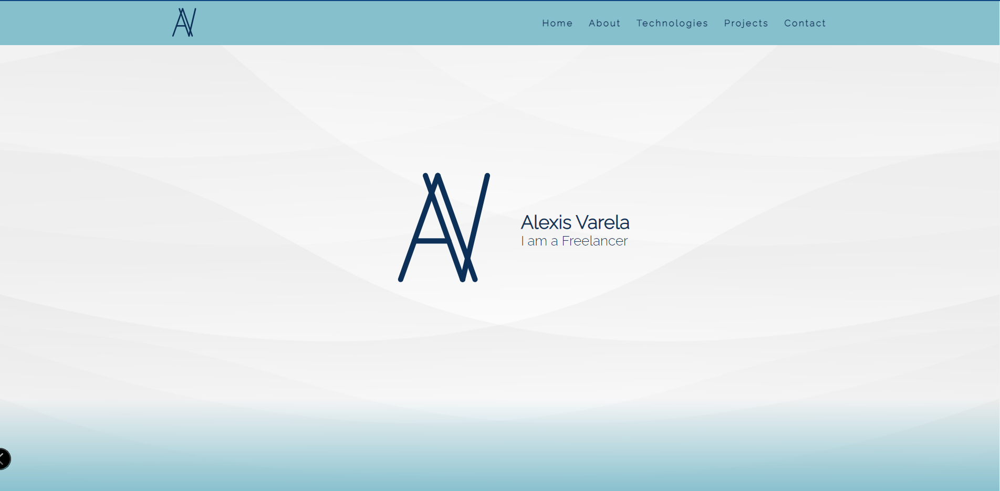
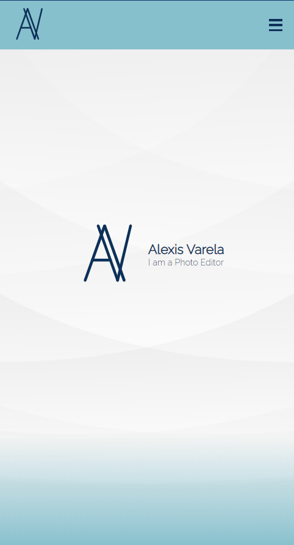

# Portfolio

This is my personal Portfolio Web Page made with basic HTML, CSS and JavaScript. Here you will find a resume of all my projects and links to my social media profiles.

## Application Screenshot

### Desktop Version



### Mobile Version



## Built With

- HTML
- CSS
- Javascript

## Live Demo

You can visit [here](https://alexisbec.github.io/Portfolio/) my Website.

## Getting Started

- Clone this repository with:
```
  https://github.com/alexisbec/Portfolio.git
```
- Open the index.html file with your favourite browser.

## Author

👤 **Alexis Varela**
- Github: [@alexisbec](https://github.com/alexisbec)
- Linkedin: [Alexis Varela](www.linkedin.com/in/alexbec)
- Twitter : [@AlexisV31667779](https://twitter.com/AlexisV31667779)

## 🤝 Contributing

Contributions, issues, and feature requests are welcome!

## Show your support

Give a ⭐️ if you like this project!

## 📝 License

This project is [MIT](https://github.com/alexisbec/Portfolio/blob/feature/LICENSE) licensed.
